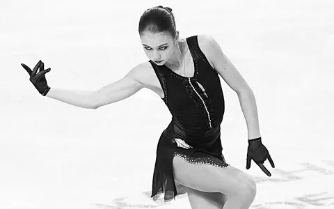
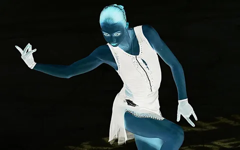

# 1. Цветовые модели  
## Исходное изображение  
  

### 1.1. Выделить компоненты R, G, B  
**Компонент R**  
  

**Компонент G**  
  

**Компонент B**  
  

---

### 1.2. Привести изображение к цветовой модели HSI  
  

---

### 1.3. Инвертировать яркостную компоненту  
  

---

# 2. Передискретизация  
### 2.1. Растяжение (интерполяция) изображения в M раз  
  

---

### 2.2. Сжатие (децимация) изображения в N раз  
  

---

### 2.3. Передискретизация изображения в \(K = M / N\) раз путём растяжения и последующего сжатия  
  

---

### 2.4. Передискретизация изображения в \(K\) раз за один проход  
  
