# Лабораторная работа №10. Обработка голоса 

## Образец собственного голоса для звука «А»
<audio controls>
  <source src="AAA.wav" type="audio/wav">
  Your browser does not support the audio element.
</audio>

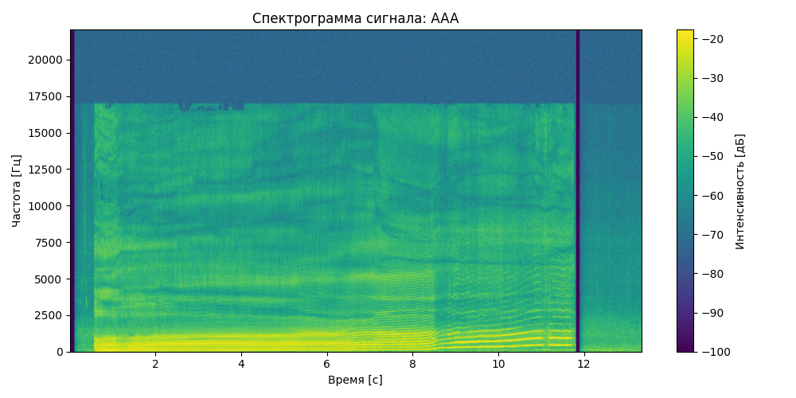
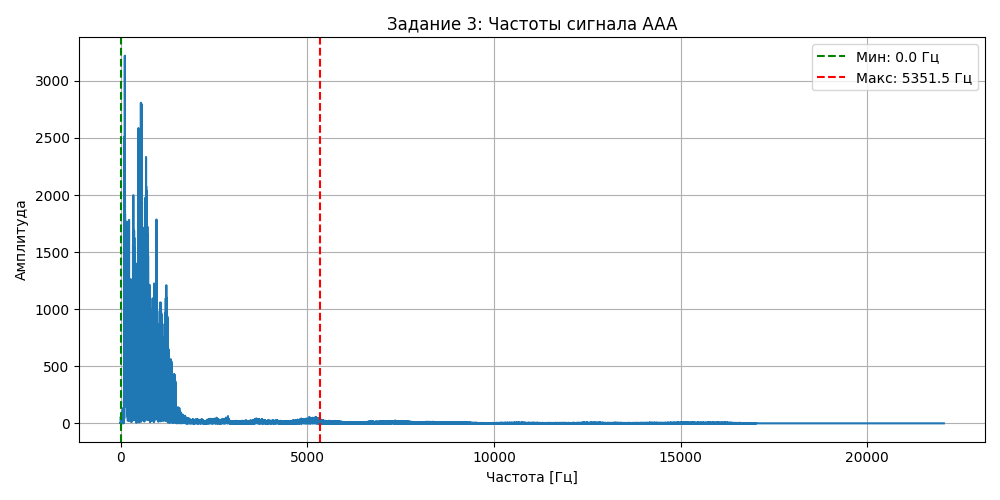
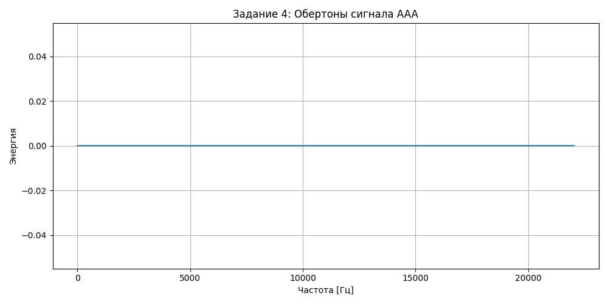
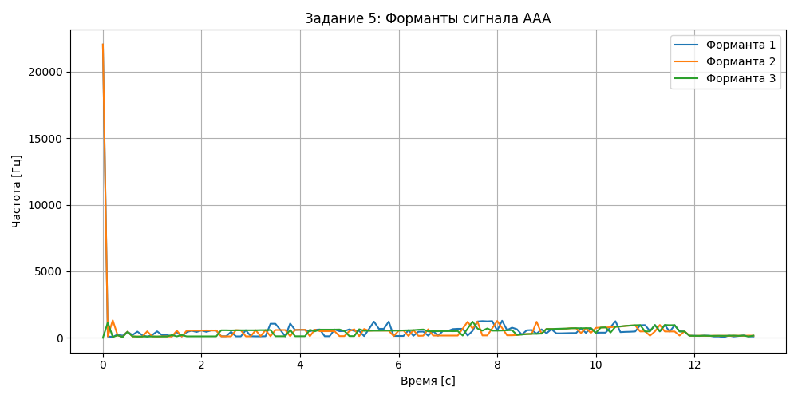

## Образец собственного голоса для звука «И»
<audio controls>
  <source src="III.wav" type="audio/wav">
  Your browser does not support the audio element.
</audio>

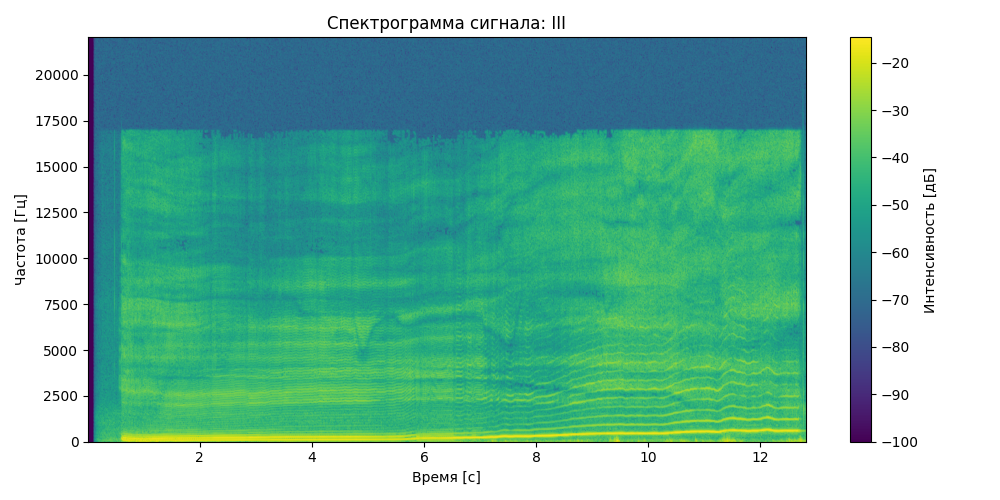
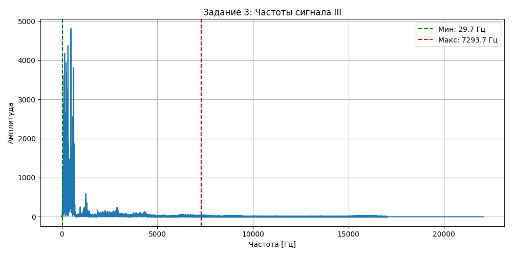
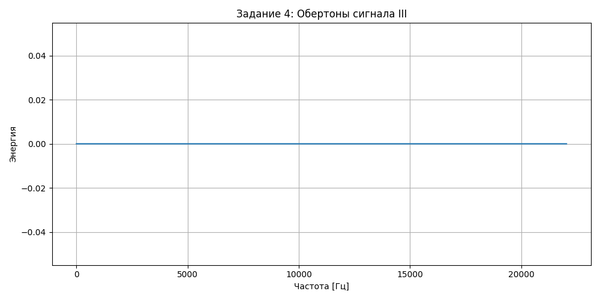
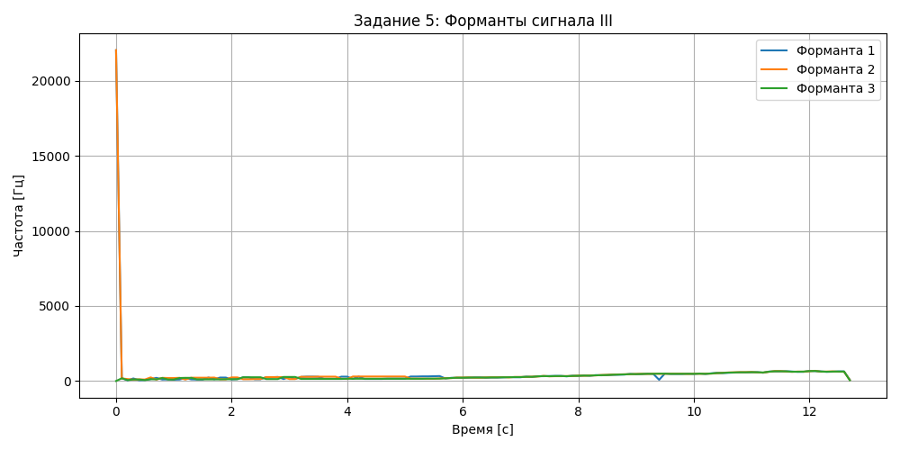

## Имитация собачьего лая
<audio controls>
  <source src="GAV.wav" type="audio/wav">
  Your browser does not support the audio element.
</audio>

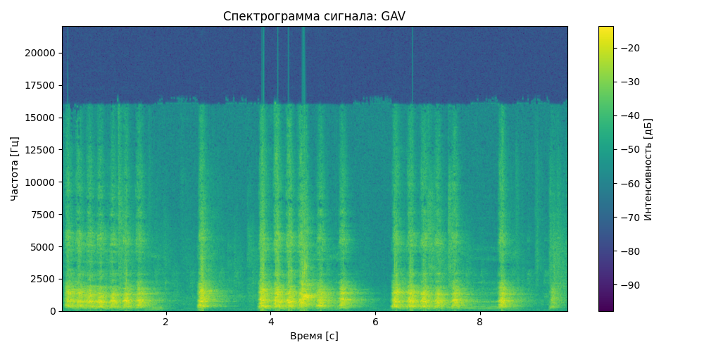
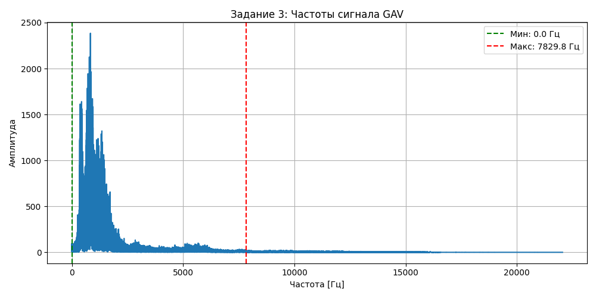
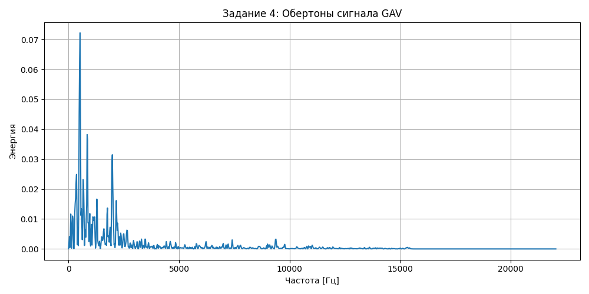
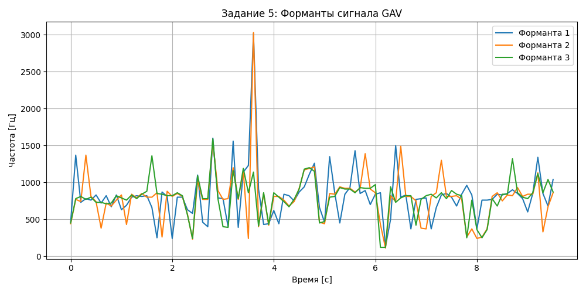
