# Лабораторная работа №2. Обесцвечивание и бинаризация растровых изображений
Исходное изображение
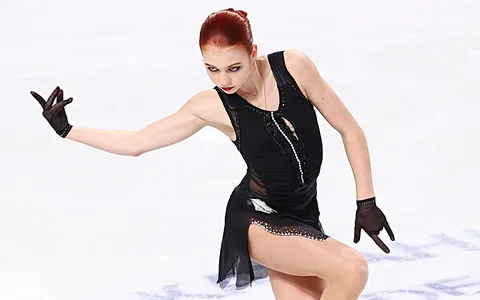
Полутоновое изображение
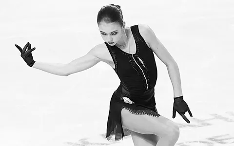

---
##### 2 Приведение полутонового изображения к монохромному методом пороговой обработки
#### Контурная карта
Оригинальное изображение
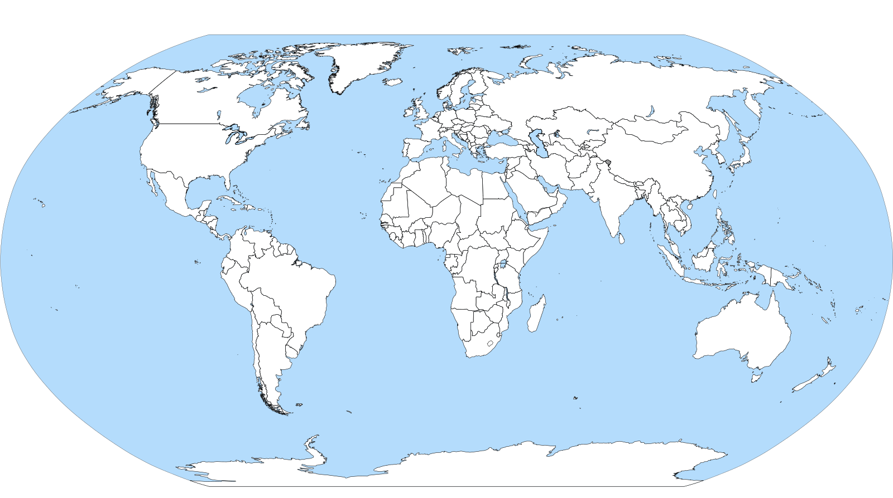

Полутоновое изображение
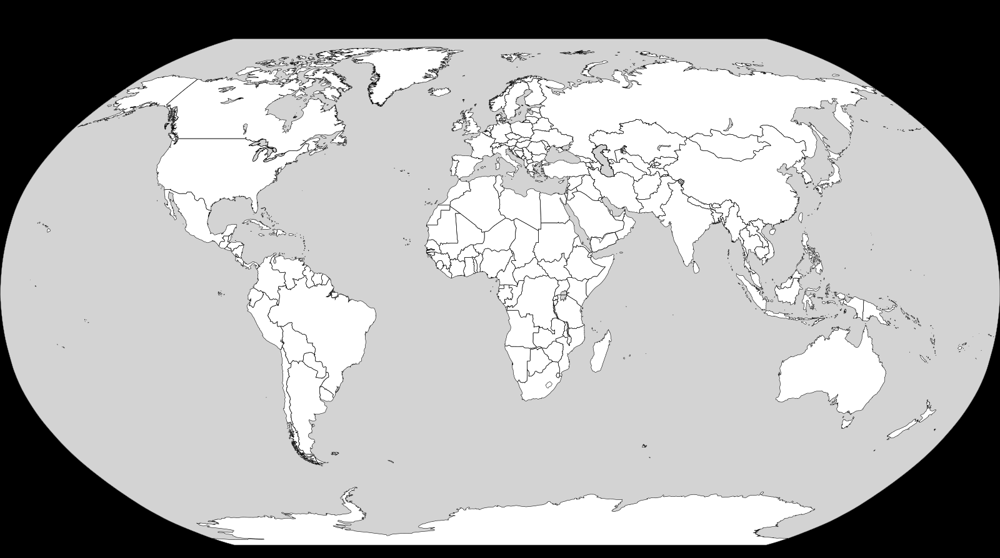

Монохромное изображение

---
#### Рентгеновский снимок
Оригинальное изображение
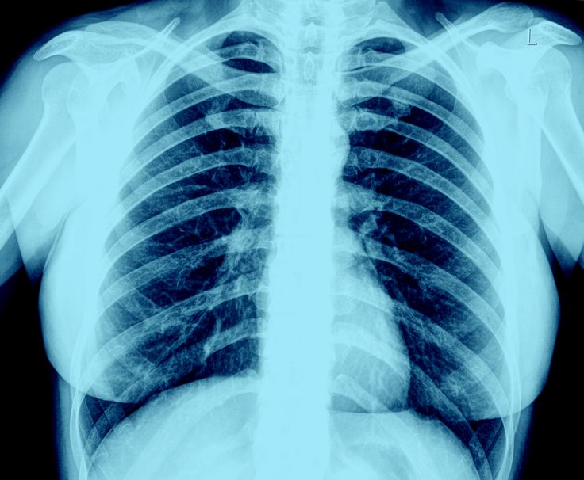

Полутоновое изображение
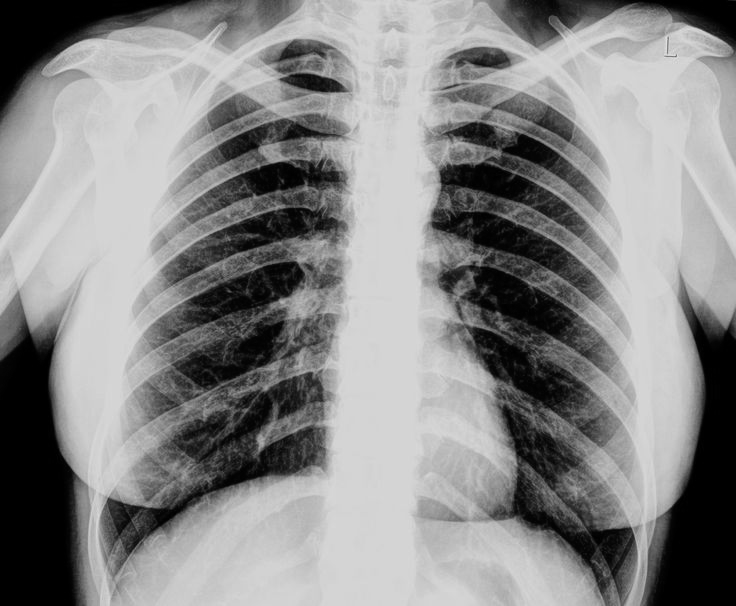

Монохромное изображение
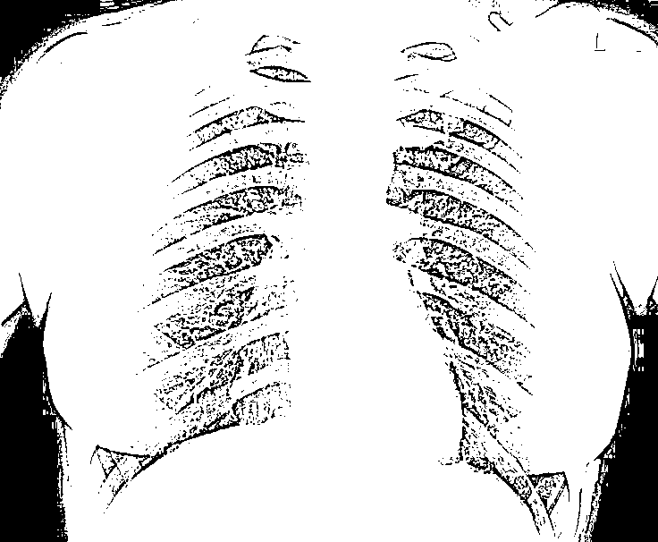

---
##### Скриншот из мультфильма
Оригинальное изображение
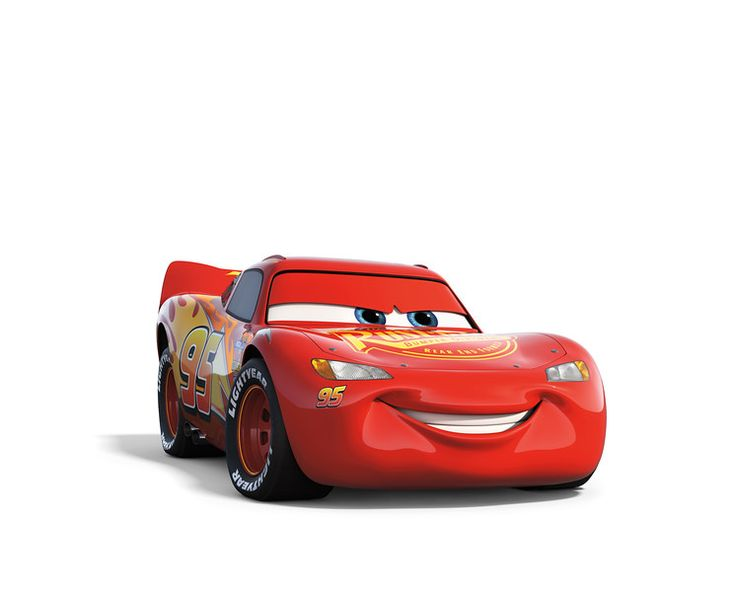

Полутоновое изображение
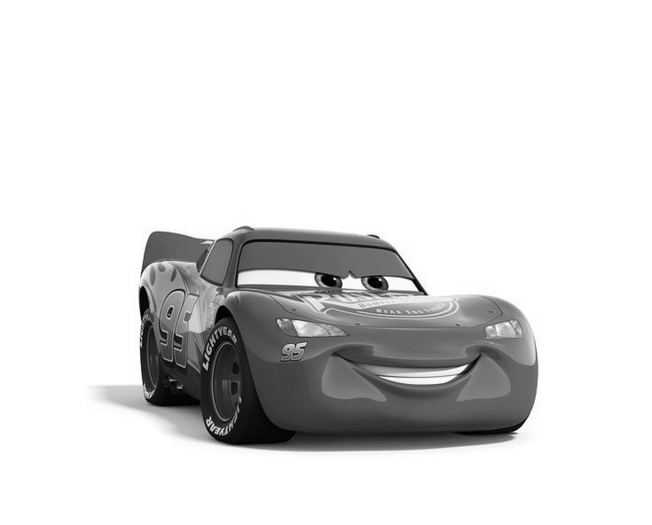

Монохромное изображение
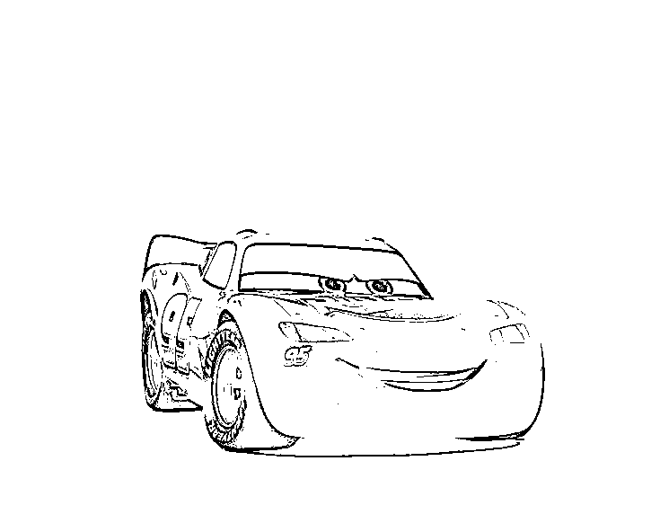

---
##### Фотография
Оригинальное изображение

Полутоновое изображение

Монохромное изображение
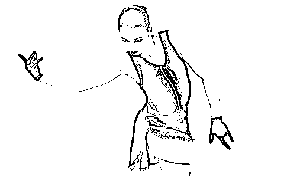

---
##### Отпечаток пальца
Оригинальное изображение

Полутоновое изображение
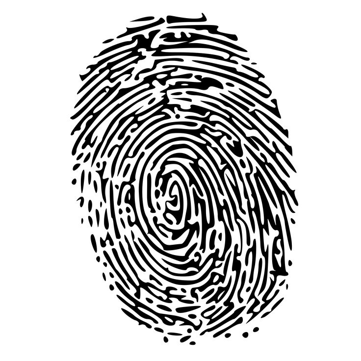

Монохромное изображение
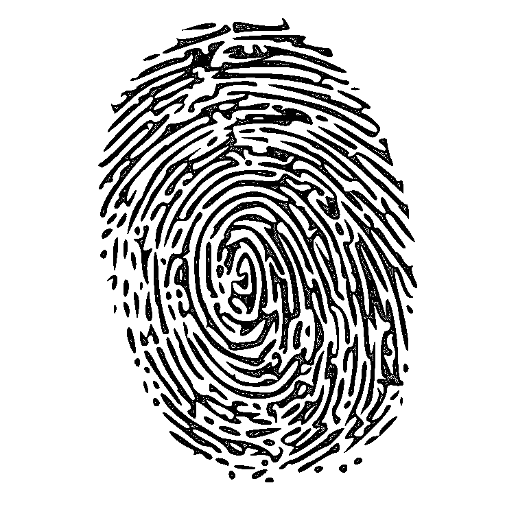

---
##### Cтраница текста
Оригинальное изображение
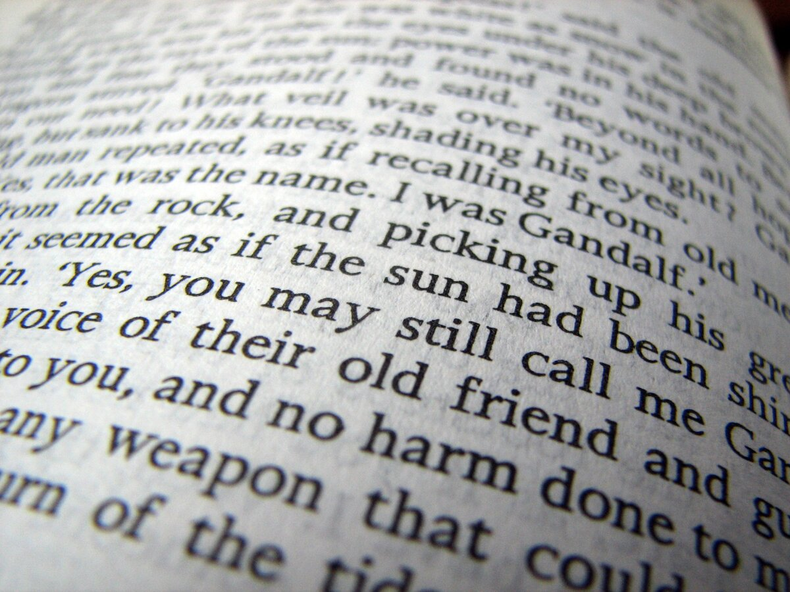

Полутоновое изображение
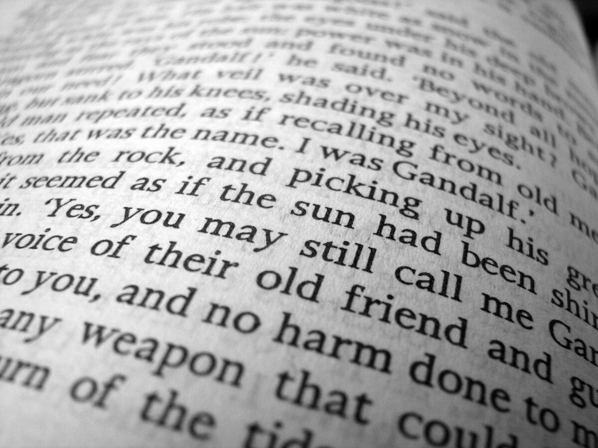

Монохромное изображение
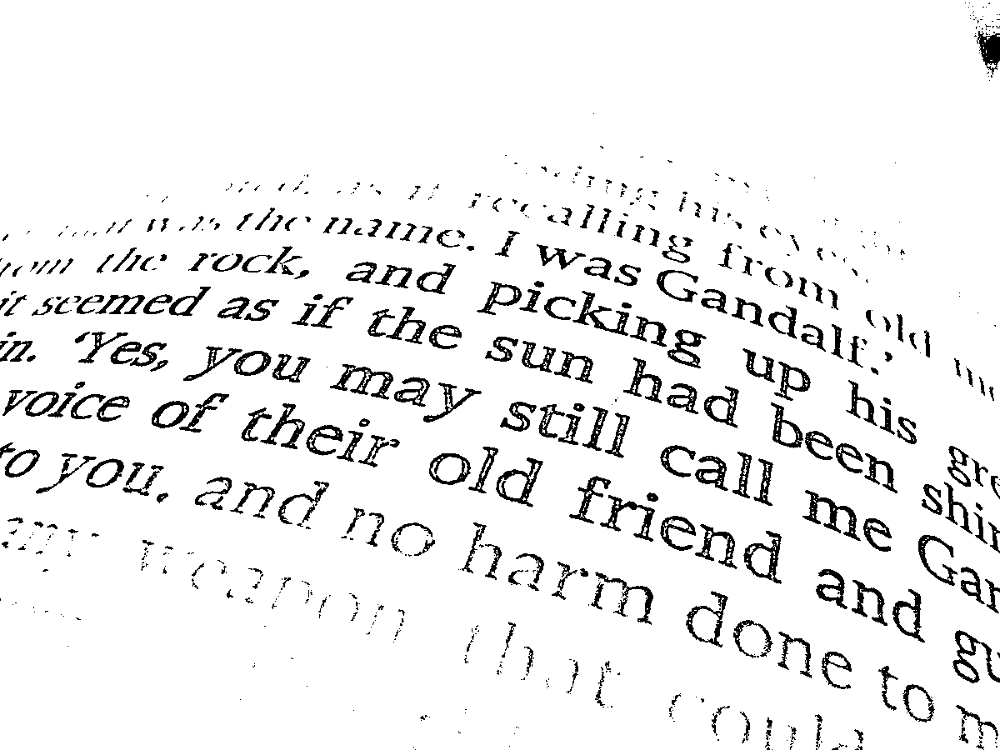
