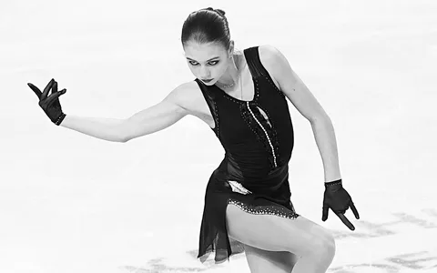

# Лабораторная работа №3. Фильтрация изображений и морфологические операции 
## Исходное изображение  
  

### 1. Отфильтрованное монохромное (полутоновое) изображение  
  

---

### 2. Разностное изображение (монохромный xor или модуль разности для полутона)
  

---

## Исходное изображение  
  

### 1. Отфильтрованное монохромное (полутоновое) изображение  
  

---

### 2. Разностное изображение (монохромный xor или модуль разности для полутона)
  