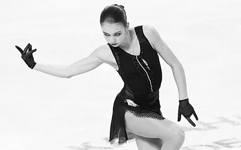
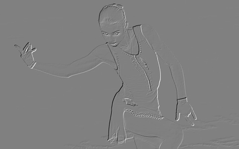
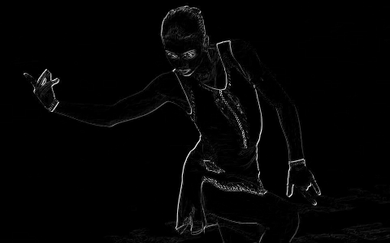
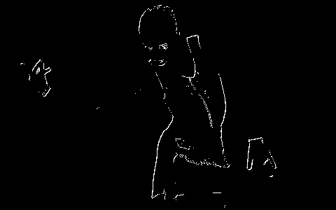
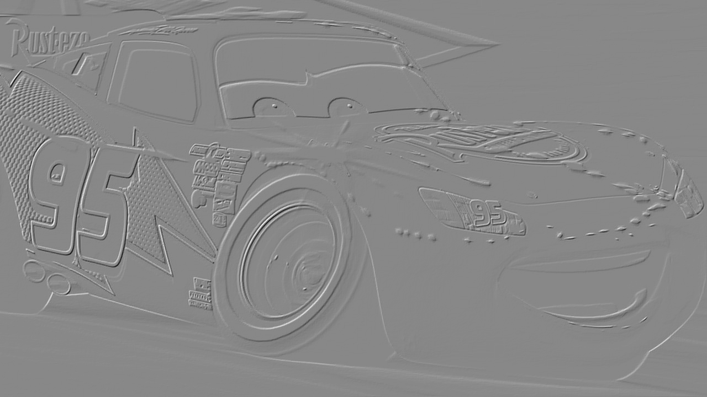
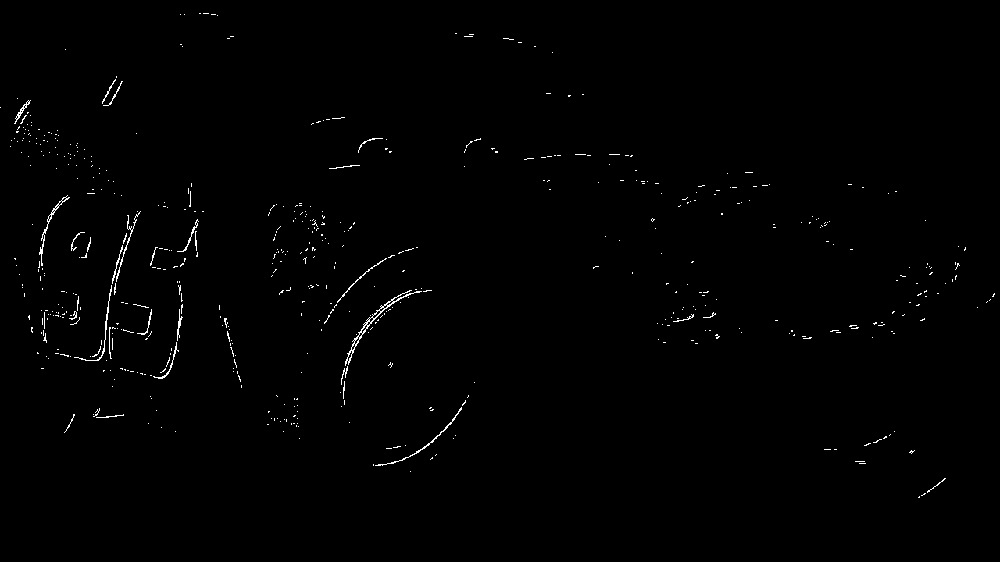

# Лабораторная работа №4 Выделение контуров на изображении

### Пример 1

#####  1. Исходное цветное изображение

##### 2. Полутоновое изображение

##### 3. Градиентные матрицы
###### 3.1 Градиентная матрица Gx 

###### 3.2 Градиентная матрица Gy

###### 3.3 Градиентная матрица G 

##### 4. Бинаризованная градиентные матрица

### Пример 2

#####  1. Исходное цветное изображение

##### 2. Полутоновое изображение

##### 3. Градиентные матрицы
###### 3.1 Градиентная матрица Gx 

###### 3.2 Градиентная матрица Gy

###### 3.3 Градиентная матрица G 

##### 4. Бинаризованная градиентные матрица

