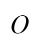

## Лабораторная работа №5. Выделение признаков символов
## Греческие заглавные буквы  
 

 

 

 

 

 

 

 

 

 

 

 

 

 

 

 

 

 

 

 

 

 

 

 

## Горизонтальные профили

## Вертикальные профили

## Набор признаков
`features.csv`

| har | q1_abs | q2_abs | q3_abs | q4_abs | q1_rel | q2_rel | q3_rel | q4_rel | center_x | center_y | center_x_rel | center_y_rel | ix | iy | ix_rel | iy_rel |
|:---:|:------:|:------:|:------:|:------:|:------:|:------:|:------:|:------:|:--------:|:--------:|:------------:|:------------:|:--:|:--:|:------:|:------:|
| Α | 0 | 21 | 69 | 154 | 0.0 | 0.0149 | 0.0491 | 0.1095 | 38.11 | 52.23 | 0.5015 | 0.6831 | 23767.68 | 12184.01 | 0.000732 | 0.000375 |
| Β | 27 | 26 | 148 | 151 | 0.0197 | 0.019 | 0.1081 | 0.1103 | 36.72 | 49.4 | 0.4893 | 0.654 | 39160.32 | 21753.16 | 0.001271 | 0.000706 |
| Γ | 18 | 38 | 148 | 21 | 0.0125 | 0.0263 | 0.1025 | 0.0145 | 33.85 | 48.24 | 0.4323 | 0.6216 | 29761.04 | 20842.16 | 0.000847 | 0.000593 |
| Δ | 33 | 23 | 154 | 142 | 0.0223 | 0.0155 | 0.1041 | 0.0959 | 39.37 | 49.24 | 0.4857 | 0.6519 | 39518.47 | 42900.25 | 0.001098 | 0.001192 |
| Ε | 27 | 28 | 157 | 61 | 0.0197 | 0.0205 | 0.1147 | 0.0446 | 34.25 | 49.86 | 0.4493 | 0.6603 | 37103.99 | 15837.06 | 0.001173 | 0.000501 |
| Ζ | 30 | 29 | 158 | 31 | 0.0213 | 0.0206 | 0.1124 | 0.022 | 33.42 | 47.41 | 0.4266 | 0.6271 | 29781.87 | 15292.39 | 0.000893 | 0.000459 |
| Η | 21 | 37 | 148 | 103 | 0.0142 | 0.025 | 0.0999 | 0.0695 | 37.85 | 50.19 | 0.4786 | 0.6473 | 35694.35 | 34807.15 | 0.00099 | 0.000965 |
| Θ | 37 | 38 | 173 | 159 | 0.0238 | 0.0245 | 0.1113 | 0.1023 | 39.86 | 48.87 | 0.4626 | 0.6469 | 48054.84 | 45021.02 | 0.001182 | 0.001108 |
| Ι | 5 | 30 | 120 | 29 | 0.0042 | 0.0253 | 0.1014 | 0.0245 | 29.72 | 49.18 | 0.4558 | 0.6511 | 23649.72 | 2505.3 | 0.001026 | 0.000109 |
| Κ | 0 | 42 | 88 | 83 | 0.0 | 0.0316 | 0.0662 | 0.0624 | 33.58 | 50.46 | 0.4655 | 0.6595 | 27830.91 | 10981.81 | 0.000956 | 0.000377 |
| Λ | 36 | 32 | 209 | 86 | 0.0243 | 0.0216 | 0.1412 | 0.0581 | 35.83 | 49.92 | 0.4409 | 0.6611 | 46627.84 | 22855.41 | 0.001295 | 0.000635 |
| Μ | 23 | 14 | 153 | 31 | 0.0178 | 0.0108 | 0.1181 | 0.0239 | 31.26 | 51.2 | 0.4323 | 0.6784 | 30207.24 | 6838.3 | 0.001065 | 0.000241 |
| Ν | 31 | 33 | 209 | 188 | 0.0186 | 0.0198 | 0.1255 | 0.1129 | 43.68 | 49.33 | 0.4742 | 0.6531 | 49781.88 | 65732.13 | 0.001069 | 0.001411 |
| Ξ | 37 | 27 | 139 | 98 | 0.0237 | 0.0173 | 0.0892 | 0.0629 | 38.43 | 48.04 | 0.4621 | 0.6272 | 33158.44 | 23835.85 | 0.000854 | 0.000614 |
| Ο | 18 | 38 | 152 | 140 | 0.0121 | 0.0256 | 0.1026 | 0.0945 | 39.67 | 49.19 | 0.5022 | 0.634 | 35822.86 | 48010.66 | 0.000993 | 0.001331 |
| Π | 28 | 27 | 155 | 65 | 0.0205 | 0.0197 | 0.1132 | 0.0475 | 35.16 | 46.68 | 0.4616 | 0.6173 | 29923.84 | 20656.96 | 0.000946 | 0.000653 |
| Ρ | 39 | 60 | 194 | 148 | 0.0233 | 0.0358 | 0.1157 | 0.0883 | 38.73 | 54.88 | 0.4901 | 0.6265 | 82282.14 | 54171.96 | 0.001787 | 0.001176 |
| Σ | 31 | 27 | 152 | 148 | 0.0226 | 0.0197 | 0.111 | 0.1081 | 36.06 | 49.27 | 0.4802 | 0.6523 | 41532.26 | 20560.88 | 0.001348 | 0.000668 |
| Τ | 22 | 31 | 92 | 110 | 0.017 | 0.024 | 0.0712 | 0.0851 | 34.28 | 49.16 | 0.4894 | 0.6337 | 31737.08 | 11279.23 | 0.001124 | 0.0004 |
| Υ | 22 | 46 | 122 | 39 | 0.0161 | 0.0336 | 0.0891 | 0.0285 | 35.85 | 46.59 | 0.4774 | 0.6161 | 31929.23 | 9447.65 | 0.001037 | 0.000307 |
| Φ | 42 | 25 | 133 | 56 | 0.027 | 0.016 | 0.0854 | 0.0359 | 37.4 | 47.35 | 0.4439 | 0.618 | 31770.36 | 28451.36 | 0.000798 | 0.000715 |
| Χ | 37 | 29 | 137 | 26 | 0.025 | 0.0196 | 0.0924 | 0.0175 | 35.55 | 45.83 | 0.4488 | 0.5977 | 23913.01 | 12328.57 | 0.00068 | 0.000351 |
| Ψ | 45 | 65 | 191 | 134 | 0.0263 | 0.038 | 0.1117 | 0.0784 | 41.56 | 46.37 | 0.4557 | 0.6049 | 42877.15 | 44835.37 | 0.000916 | 0.000958 |
| Ω | 35 | 28 | 167 | 60 | 0.0231 | 0.0185 | 0.1101 | 0.0396 | 37.55 | 48.93 | 0.4458 | 0.6478 | 39937.76 | 16855.72 | 0.001031 | 0.000435 |
